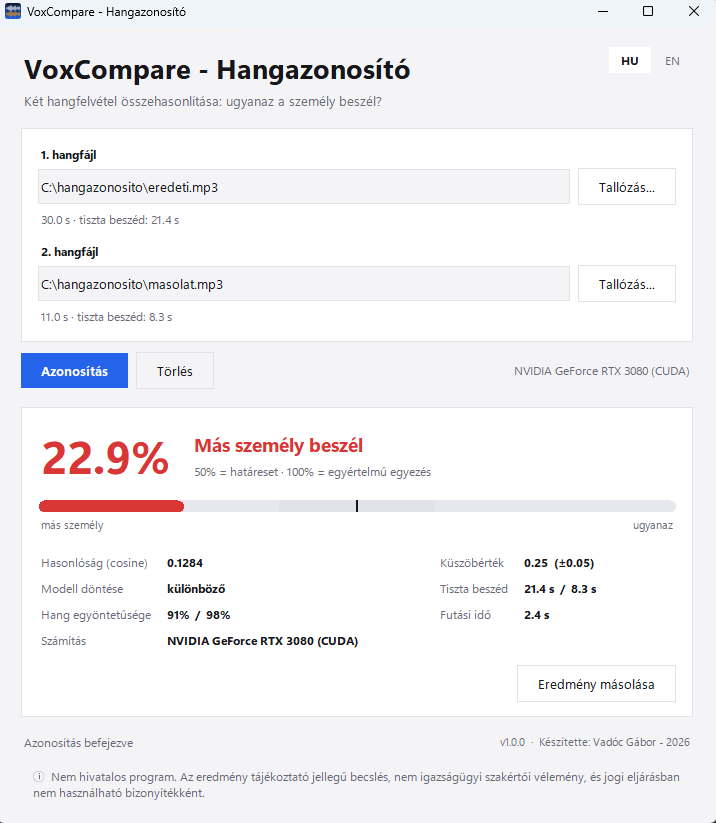

# VoxCompare - Hangazonosító

> **Compare two recordings and find out whether the same person is speaking.** Runs fully offline on your PC, GPU-accelerated if you have one. English & Hungarian UI.
>
> **Két hangfelvételt hasonlít össze, és megmondja, hogy ugyanaz a személy beszél-e.** Teljesen offline fut a gépeden, videókártyával gyorsítva, ha van. Magyar és angol felület.

<p align="center"></p>

<p align="center"><a href="../../releases/latest"><b>⬇ Download / Letöltés</b></a></p>

> ⚠️ **Nem hivatalos program.** Az eredmény tájékoztató jellegű becslés, **nem igazságügyi szakértői vélemény**, és jogi eljárásban nem használható bizonyítékként.
> ⚠️ **Unofficial software.** The result is an informative estimate, **not a forensic expert opinion**, and must not be used as evidence in legal proceedings.

**🇭🇺 Magyar** · [🇬🇧 English below](#-english)

---

## 🇭🇺 Magyar

### Mit tud

- **Két felvétel összehasonlítása** (WAV, MP3, FLAC, OGG külső eszköz nélkül; M4A/AAC/WMA FFmpeg-gel).
- **Pontosabb eredmény:** a program előbb eltávolítja a csendet, majd a felvételt átfedő, 6 másodperces szakaszokra bontja, és a szakaszok átlagolt „hangujjlenyomatát” hasonlítja össze. Így a hosszú felvétel és a hosszabb szünetek nem torzítják az eredményt.
- **Egyöntetűség-ellenőrzés:** figyelmeztet, ha egy felvételen valószínűleg több személy beszél.
- **Érthető eredmény:** százalék, ítélet, mérőcsík a küszöbértékkel és a bizonytalan sávval, és a részletes mutatók (hasonlóság, tiszta beszéd hossza, futási idő). Az eredmény vágólapra másolható.
- **GPU-gyorsítás** (NVIDIA CUDA), különben processzoron fut. Az exe CPU-s, a forrásból futtatott változat a CUDA-t is használja.
- **Offline és privát:** a modell a telepítővel együtt érkezik, a felvételek nem hagyják el a gépet.
- Magyar/angol felület (jobb felső sarokban váltható), világos/sötét téma a Windows beállítása szerint.

### Telepítés

1. Töltsd le a legfrissebb **`VoxCompare-Setup-x.y.z.exe`** telepítőt a [Releases](../../releases) oldalról. A program a `Program Files` mappába települ, Start menü parancsikonnal (az asztali ikon opcionális).
2. Telepítés nélkül: töltsd le a **`VoxCompare-portable-x.y.z.zip`** fájlt, csomagold ki, és indítsd a `VoxCompare.exe`-t.

> Az exe nincs digitálisan aláírva, ezért a Windows SmartScreen figyelmeztethet („További információ → Futtatás mindenképp”). A fájlok SHA256-összege a kiadás leírásában szerepel.

### Használat

1. Válaszd ki az **1.** és a **2.** hangfájlt (**Tallózás…**, vagy írd be az útvonalat).
2. Kattints az **Azonosítás** gombra (vagy nyomj Entert).
3. Olvasd le az eredményt: a nagy százalék a megbízhatóság, alatta az ítélet és a mérőcsík.

### Hogyan értelmezd az eredményt

| Eredmény | Jelentés |
|---|---|
| **Hasonlóság > 0,30** (zöld) | Valószínűleg ugyanaz a személy |
| **0,20 – 0,30** (narancs) | Bizonytalan, a határérték közelében |
| **< 0,20** (piros) | Valószínűleg más személy |

- A **százalék nem kalibrált valószínűség**: 50% pontosan a döntési küszöbön van (0,25), a skála efelé és az alatta/felett lévő pontszámokat képezi le 0–100 közé.
- A modell az emberi **hangszínt** hasonlítja össze, nem a tartalmat. Ezért a hangutánzás vagy a hangklónozás (deepfake) átverheti, és az eredmény **nem jogi bizonyíték**.
- A pontosság romlik rövid (3 s alatti tiszta beszéd), zajos, zenével kevert vagy erősen tömörített felvételeknél. A program figyelmeztet, ha kevés a tiszta beszéd.

### Tippek a pontos eredményhez

- Legalább **3–5 s tiszta beszéd** felvételenként, egy beszélővel, kevés háttérzajjal.
- Hasonló felvételi körülmények (mikrofon, távolság) pontosabb eredményt adnak.
- Telefonos vagy tömörített felvétel is használható, de az eredmény bizonytalanabb.

### Futtatás forrásból

Követelmény: Python 3.9+, NVIDIA GPU opcionális.

```
python -m venv venv && venv\Scripts\activate
pip install torch torchaudio --index-url https://download.pytorch.org/whl/cu121   # CPU esetén: pip install torch torchaudio
pip install -r requirements.txt
python main.py                                  # grafikus felület
python main.py --compare a.wav b.wav            # parancssori összehasonlítás
python -m unittest discover tests               # tesztek
```

Az első indításkor a modell (kb. 85 MB) letöltődik a `pretrained_models` mappába. Exe és telepítő építése: `build.bat` (PyInstaller + Inno Setup 6).

### Hibaelhárítás

| Tünet | Megoldás |
|---|---|
| „A(z) .M4A formátumhoz FFmpeg szükséges” | `winget install ffmpeg`, vagy konvertáld WAV/MP3-ra |
| „A modell betöltése nem sikerült” (forrásból) | Ellenőrizd az internetet az első indításnál, vagy töröld a `pretrained_models` mappát |
| Lassú | CPU-n a futás néhány másodperc; CUDA-s PyTorch gyorsít (forrásból) |
| Figyelmeztetés: „kevés tiszta beszéd” | Használj hosszabb, tisztább felvételt |

### Technológia

[SpeechBrain](https://speechbrain.github.io/) ECAPA-TDNN modell (`spkrec-ecapa-voxceleb`, Apache-2.0), [VoxCeleb](https://www.robots.ox.ac.uk/~vgg/data/voxceleb/) adathalmazon tanítva; PyTorch; Tkinter.

---

## 🇬🇧 English

### Features

- **Compares two recordings** (WAV, MP3, FLAC, OGG with no external tool; M4A/AAC/WMA need FFmpeg).
- **More accurate result:** silence is removed first, the recording is split into overlapping 6-second windows and the averaged voice print of the windows is compared. Long recordings and long pauses no longer skew the result.
- **Consistency check:** warns when a recording probably contains more than one speaker.
- **Readable result:** percentage, verdict, a gauge with the threshold and the uncertain band, and detailed metrics (similarity, net speech length, run time). The result can be copied to the clipboard.
- **GPU acceleration** (NVIDIA CUDA), otherwise it runs on the CPU. The exe is CPU-only; running from source also uses CUDA.
- **Offline and private:** the model ships with the installer, recordings never leave your PC.
- Hungarian/English UI (switch in the top right corner), light/dark theme following Windows.

### Installation

1. Download the latest **`VoxCompare-Setup-x.y.z.exe`** from [Releases](../../releases). It installs to `Program Files` with a Start menu shortcut (desktop icon optional).
2. No install: download **`VoxCompare-portable-x.y.z.zip`**, extract it and run `VoxCompare.exe`.

> The exe is not code-signed, so Windows SmartScreen may warn you ("More info → Run anyway"). SHA256 checksums are in the release notes.

### Usage

1. Select **file 1** and **file 2** (**Browse…**, or type the path).
2. Click **Verify** (or press Enter).
3. Read the result: the big percentage is the confidence, below it the verdict and the gauge.

### How to read the result

| Result | Meaning |
|---|---|
| **Similarity > 0.30** (green) | Probably the same person |
| **0.20 – 0.30** (orange) | Uncertain, close to the threshold |
| **< 0.20** (red) | Probably a different person |

- The **percentage is not a calibrated probability**: 50% sits exactly on the decision threshold (0.25); the scale maps scores above and below it to 0-100.
- The model compares the human **voice timbre**, not the content. Impersonation or voice cloning (deepfakes) can fool it, and the result is **not legal evidence**.
- Accuracy drops for short (under 3 s of net speech), noisy, music-mixed or heavily compressed recordings. The app warns when there is little clean speech.

### Tips for an accurate result

- At least **3-5 s of clean speech** per recording, one speaker, little background noise.
- Similar recording conditions (microphone, distance) give more accurate results.
- Phone or compressed recordings work, but the result is less certain.

### Running from source

Requires Python 3.9+, NVIDIA GPU optional.

```
python -m venv venv && venv\Scripts\activate
pip install torch torchaudio --index-url https://download.pytorch.org/whl/cu121   # CPU only: pip install torch torchaudio
pip install -r requirements.txt
python main.py                                  # GUI
python main.py --compare a.wav b.wav            # command-line comparison
python -m unittest discover tests               # tests
```

On first run the model (about 85 MB) is downloaded to the `pretrained_models` folder. Build the exe and installer with `build.bat` (PyInstaller + Inno Setup 6).

### Troubleshooting

| Symptom | Fix |
|---|---|
| "The .M4A format needs FFmpeg" | `winget install ffmpeg`, or convert to WAV/MP3 |
| "Could not load the model" (from source) | Check your internet on first run, or delete the `pretrained_models` folder |
| Slow | On CPU a run takes a few seconds; a CUDA build of PyTorch speeds it up (from source) |
| Warning: "little net speech" | Use a longer, cleaner recording |

### Technology

[SpeechBrain](https://speechbrain.github.io/) ECAPA-TDNN model (`spkrec-ecapa-voxceleb`, Apache-2.0), trained on [VoxCeleb](https://www.robots.ox.ac.uk/~vgg/data/voxceleb/); PyTorch; Tkinter.

---

## License / Licenc

MIT – see [LICENSE](LICENSE). The bundled speaker model is distributed under its own Apache-2.0 license (SpeechBrain).

Készítette / Created by: **Vadóc Gábor** – 2026
